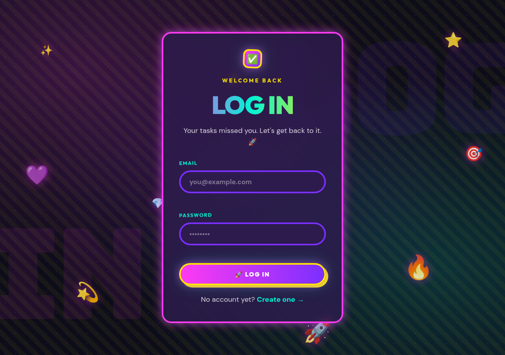
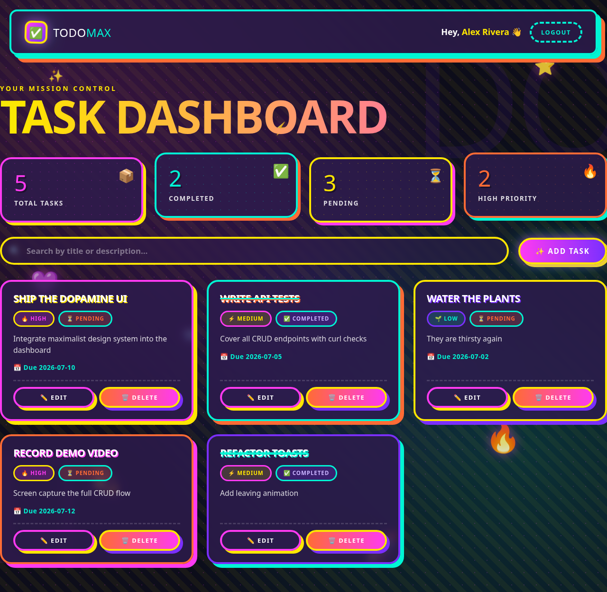
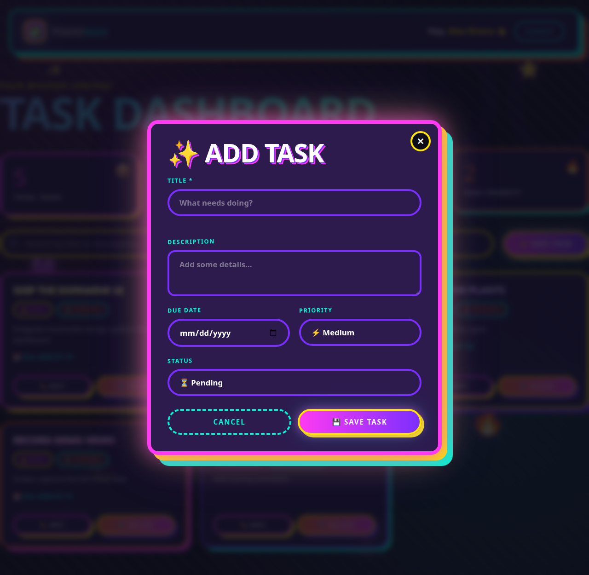

# simple-todo-crud-batch18

A **TODO CRUD application** built with **Node.js**, **MySQL**, and **npm workspaces**
(monorepo). It ships in **two fully working front-ends that share the exact same
backend logic**:

1. 🖥️ **Console app** — the original interactive CLI (`npm run start`).
2. 🌈 **Web app** — a **Maximalism / Dopamine** styled dashboard served by a thin
   REST API (`npm run server`).

Both use the same layered architecture (config → models → services), the same
MySQL schema, and the same validation + bcrypt logic. The web layer is **purely
additive** — it reuses the existing services and does not modify the console app.

---

## 📸 Screenshots

| Login | Register |
| --- | --- |
|  |  |

| Dashboard | Add / Edit Task Modal |
| --- | --- |
|  |  |

> Screenshots are captured from the live app. Re-generate them any time by running
> the server and visiting `http://localhost:3000`.

---

## 🎥 Video Demo

_Add a link to your video walkthrough here._

- Demo video: _placeholder — e.g. 

https://github.com/user-attachments/assets/53bc0759-91f8-45b9-8716-556e8a633edb


Suggested demo script: register → login → add a task → edit it → search → delete
(with confirmation) → logout.

---

## ✨ Features

### User Module
- **Register** — name required, unique + valid email, password ≥ 4 chars, hashed with **bcrypt**.
- **Login** — validates credentials; a single safe message for wrong email *or* password.
- Web sessions use short-lived **JWT** tokens; the CLI uses an in-memory session.

### Task Module (CRUD)
- **Add / Edit / Delete / View / Search** — every read is scoped to the logged-in user.
- **Delete** requires confirmation (yes/no in CLI, modal dialog on the web).
- **Search** matches both `title` and `description`.
- `title` required · `priority` ∈ {Low, Medium, High} · `status` ∈ {Pending, Completed}.

### Web UI (Maximalism / Dopamine design system)
- 5-accent color rotation, clashing borders, multi-layer shadows, layered patterns.
- Dashboard **statistics** (total / completed / pending / high-priority).
- Reusable components, responsive layout, **status & priority badges**.
- **Empty / loading / error** states, animated toasts, and an accessible Add/Edit modal.
- Smooth motion with `prefers-reduced-motion` support.

---

## 🧱 Project Structure

```
simple-todo-crud-batch18/
│
├── package.json          # root workspace manifest (start + server scripts)
├── .gitignore            # ignores node_modules and .env
├── .env.example          # sample environment configuration
├── database.sql          # MySQL schema (todo_app)
├── README.md
├── docs/screenshots/     # README screenshots
│
├── api/                          # backend workspace
│   ├── package.json
│   └── src/
│       ├── config/db.js          # mysql2 connection pool
│       ├── models/               # users + tasks data-access (SQL only)
│       ├── services/             # auth + task business rules (shared by CLI & API)
│       ├── utils/                # validation + console menu helpers
│       ├── middleware/auth.js    # JWT sign + guard (web only)      [ADDED]
│       ├── controllers/          # HTTP adapters over the services  [ADDED]
│       ├── routes/               # /api/auth + /api/tasks routers    [ADDED]
│       ├── app.js                # interactive console menu loop
│       ├── index.js              # console entry point
│       └── server.js             # Express REST API + static host   [ADDED]
│
├── shared/                       # shared workspace
│   ├── package.json
│   └── constants.js              # priorities, statuses, regex, limits
│
└── frontend/                     # web UI (static, framework-free)  [ADDED]
    ├── pages/                    # login.html, register.html, dashboard.html
    ├── css/                      # style.css (tokens+components), animation.css
    ├── js/                       # app.js (auth+chrome), task.js (dashboard)
    ├── components/               # api.js, ui.js, modal.js (reusable modules)
    └── assets/                   # favicon.svg, sparkle.svg
```

---

## 🗄️ Database Schema

Database: **`todo_app`** — full script in [`database.sql`](database.sql).

```sql
users ( id PK AI, name, email UNIQUE, password )
tasks ( id PK AI, userId FK->users.id (ON DELETE CASCADE),
        title, description, dueDate,
        priority ENUM('Low','Medium','High') DEFAULT 'Medium',
        status   ENUM('Pending','Completed') DEFAULT 'Pending',
        createdAt TIMESTAMP, updatedAt TIMESTAMP ON UPDATE )
```

---

## 🚀 Setup Guide

### 1. Prerequisites
- Node.js 18+ (tested on Node 22)
- A running MySQL 8 server

### 2. Install dependencies
```bash
npm install
```
> npm workspaces installs `api` + `shared` and links `shared` automatically.

### 3. Configure environment
```bash
cp .env.example .env
```
Edit `.env` with your MySQL credentials (and set a strong `JWT_SECRET` for the web app):
```env
DB_HOST=localhost
DB_PORT=3306
DB_USER=root
DB_PASSWORD=your_mysql_password
DB_NAME=todo_app
BCRYPT_SALT_ROUNDS=10
PORT=3000
JWT_SECRET=change-this-to-a-long-random-string
```
> Optional: set `DB_SOCKET=/path/to/mysqld.sock` to connect over a UNIX socket.

### 4. Create the database
```bash
mysql -u root -p < database.sql
```

### 5a. Run the console app
```bash
npm run start
```

### 5b. Run the web app (frontend + REST API)
```bash
npm run server
```
Then open **http://localhost:3000** in your browser.

---

## 🧾 Commands

| Command          | Description                                       |
| ---------------- | ------------------------------------------------- |
| `npm install`    | Install all workspace dependencies                |
| `npm run start`  | Start the **console** application                 |
| `npm run server` | Start the **web** app (frontend + REST API)       |
| `npm run db:setup` | Load `database.sql` into MySQL                  |

---

## 🌐 REST API Reference

All `/api/tasks` routes require an `Authorization: Bearer <token>` header.

| Method | Endpoint                 | Description                     |
| ------ | ------------------------ | ------------------------------- |
| POST   | `/api/auth/register`     | Create an account               |
| POST   | `/api/auth/login`        | Log in → `{ token, user }`      |
| GET    | `/api/tasks`             | List the user's tasks           |
| GET    | `/api/tasks/search?q=`   | Search by title/description     |
| POST   | `/api/tasks`             | Create a task                   |
| GET    | `/api/tasks/:id`         | Get one task                    |
| PUT    | `/api/tasks/:id`         | Update a task                   |
| DELETE | `/api/tasks/:id`         | Delete a task                   |

---

## 🏗️ Architecture Notes

- **Shared core, two front-ends:** `services/` enforce all validation, hashing, and
  business rules. The console UI (`app.js`) and the HTTP controllers both call the
  *same* services — no logic is duplicated and behaviour stays identical.
- **Additive web layer:** `server.js`, `routes/`, `controllers/`, and `middleware/`
  were added without touching `index.js`, `app.js`, the models, `db.js`, or the schema.
- **Frontend:** framework-free HTML/CSS/JS with the design system expressed as CSS
  custom-property tokens, reusable ES-module components, and clean separation of
  concerns (`api.js` transport, `ui.js` presentation, `modal.js` dialogs).
- **Security:** bcrypt-hashed passwords, JWT sessions, generic login errors to avoid
  user enumeration, and per-user data isolation enforced in the model layer.
- **Accessibility:** semantic HTML, visible focus states, `aria-hidden` on decorations,
  `aria-live` regions, and `prefers-reduced-motion` support.

---

## 📄 License

MIT
